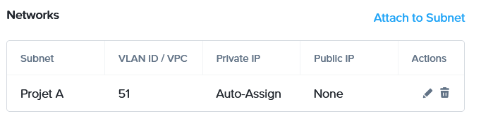
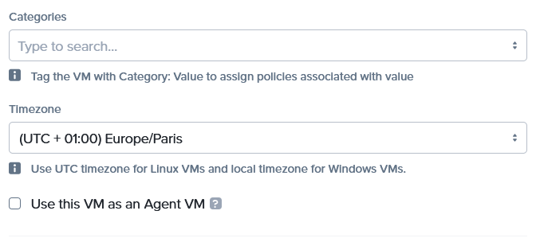
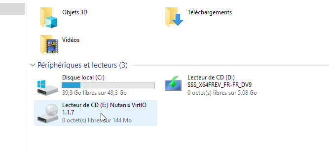
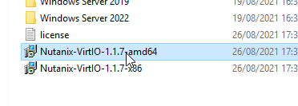
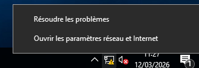
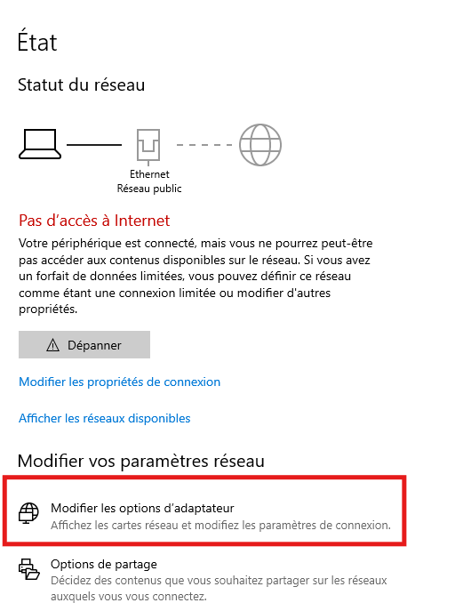
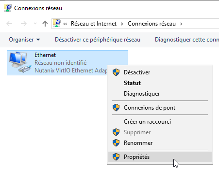

**SP 3 : Déploiement d'un serveur Windows 2019**

**Mission 1 : Installation et configuration d'un contrôleur de domaine (AD/DNS)**

**Contexte : MILLENUITS**


---
## Informations générales

- **Date de création** : 05/02/2026
- **Dernière modification** : 12/03/2026
- **Auteur** : MEDO Louis

---
## Sommaire

1. [Création de la machine virtuelle sur Nutanix](#1-création-de-la-machine-virtuelle-sur-nutanix)
2. [Installation des pilotes sur Windows Server](#2-installation-des-pilotes-sur-windows-server)
3. [Configuration réseau de Windows Server](#3-configuration-réseau-de-windows-server)
4. [Configuration post-installation](#4. Configuration post-installation)
5. [Installation conjointe des rôles Active Directory et DNS](#5. Installation conjointe des rôles Active Directory et DNS)

---
## Objectif

Déployer une machine virtuelle Windows Server 2019 sur l'infrastructure Nutanix, configurer ses paramètres réseau de base avec une IP statique, et installer les rôles Active Directory Domain Services (AD DS) ainsi que DNS. Cette procédure vise à établir un contrôleur de domaine fonctionnel répondant aux standards des infrastructures d'entreprise.

---
## 1. Création de la machine virtuelle sur Nutanix

**Configuration :**
1. **Création de la machine virtuelle.** Aller dans l'interface de Nutanix, puis cliquer sur *Create VM*. Saisir les informations suivantes :

   - **Name :** `SIO1 - AP - GPI1 - MN01`
   - **Description :** `Millenuits - Active directory`
   - **Project :** `SIO1-Etudiant 2`
   - **CPU :** 1

**Ressources :**
1. **Création des disques et ajout des images ISO.** Créer le disque de stockage pour Windows Server, puis monter l'image ISO pour l'installation de l'OS ainsi que l'image ISO contenant les pilotes VirtIO.
   
   
2. **Configuration du réseau.** Sélectionner le réseau `Projet A` avec l'ID VLAN `51`.
   
   
3. **Configuration du boot.** Choisir le mode `UEFI BIOS Mode`.
   
**Management :**
4. **Configuration de l'heure.** Sélectionner le fuseau horaire `Europe/Paris`.
   

!!! note

    Veillez à provisionner un disque de taille suffisante (minimum 60 Go pour une version avec interface graphique) afin d'anticiper la croissance de la base de données NTDS et les futures mises à jour Windows.

---
## 2. Installation des pilotes sur Windows Server

1. **Trouver le pilote.** Dans l'explorateur de fichiers (Ce PC), ouvrir le `Lecteur de CD : Nutanix VirtIO 1.1.7`.
   
 
2. **Installer le pilote.** Exécuter l'installateur `Nutanix-VirtIO-1.1.7-amd64` pour déployer les pilotes sur Windows Server.
   
   
---
## 3. Configuration réseau de Windows Server

1. **Ouvrir les paramètres réseau.** Effectuer un clic droit sur l'icône réseau dans la barre des tâches, puis cliquer sur `Ouvrir les paramètres réseau et Internet`.
   
   
2. **Ouvrir le panneau de configuration.** Cliquer sur l'option `Modifier les options d'adaptateur`.
   

3. **Ouvrir les propriétés de la carte réseau.** Effectuer un clic droit sur la carte réseau concernée et sélectionner `Propriétés`.
   

4. **Configurer les paramètres IPv4.** Désactiver l'IPv6 en décochant la case correspondante. Sélectionner `Protocole Internet version 4 (TCP/IPv4)` puis cliquer sur `Propriétés`. 
   

5. **Saisir les informations réseau.** Cocher la case `Utiliser l'adresse IP suivante`, puis renseigner les paramètres IP statiques souhaités en suivant le plan d'adressage du projet.
   

!!! tip

	Un contrôleur de domaine nécessite obligatoirement une IP statique. Pour le serveur DNS primaire de cette carte réseau, renseignez l'adresse IP de bouclage (`127.0.0.1`) ou l'IP statique du serveur lui-même.

6. **Vérification.** Pour s'assurer que les paramètres réseau sont valides, vérifiez l'accès à la passerelle, à Internet et à la résolution DNS via l'invite de commandes.
   
   **Les commandes à tester et leur explication :**

   - [ ] `ping 172.16.51.252` : Envoie des paquets ICMP pour valider la connectivité au niveau local entre le serveur et sa passerelle.
   - [ ] `ping 9.9.9.9` : Teste le routage vers l'extérieur (Internet) en interrogeant le serveur DNS public de Quad9.
   - [ ] `ping loutik.fr` : Vérifie que le service de résolution de noms (DNS) fonctionne correctement en traduisant le nom de domaine en adresse IP.
   
---
## 4. Configuration post-installation

1. **Changement du mot de passe Administrateur local.** Il est impératif de sécuriser le compte par défaut en appliquant un mot de passe fort (minimum 16 caractères, généré de manière aléatoire et stocké de manière sécurisée via le gestionnaire de mots de passe Bitwarden). Ouvrir une invite de commandes ou PowerShell en tant qu'administrateur.
   
   **Commande à exécuter :**

```powershell
   net user Administrateur "VotreMotDePasseBitwarden!"
```

   - `net user` : Utilitaire en ligne de commande permettant de gérer les comptes d'utilisateurs locaux.
   - `Administrateur` : Cible le compte système par défaut.
   - `"VotreMotDePasse..."` : Remplace l'ancien mot de passe par la nouvelle chaîne de caractères spécifiée.

2. **Activation du Bureau à distance (RDP).** Cette action permet l'administration à distance du serveur, évitant ainsi de passer systématiquement par la console virtuelle Nutanix. Dans le *Gestionnaire de serveur*, aller dans *Serveur local*, cliquer sur le lien `Désactivé` à côté de *Bureau à distance*, puis cocher `Autoriser les connexions à distance à cet ordinateur`.

   **Alternative en commande PowerShell :**

```powershell
   Set-ItemProperty -Path 'HKLM:\System\CurrentControlSet\Control\Terminal Server' -name "fDenyTSConnections" -value 0
   Enable-NetFirewallRule -DisplayGroup "Bureau à distance"
```

   - `Set-ItemProperty` : Modifie une clé de registre. Ici, la valeur `0` autorise la fonctionnalité de connexions Terminal Server (RDP).
   - `Enable-NetFirewallRule` : Active la règle du pare-feu Windows, ouvrant ainsi le port TCP 3389 nécessaire au flux RDP.

!!! tip

	Une fois l'Active Directory déployé, évitez d'utiliser le compte Administrateur intégré pour les tâches quotidiennes. Créez des comptes nominatifs avec des privilèges de délégation stricts (principe de moindre privilège).

---
## 5. Installation conjointe des rôles Active Directory et DNS

!!! info

	Dans les règles de l'art, le rôle DNS ne s'installe pas isolément au préalable. Il est déployé et configuré automatiquement lors de la promotion du serveur en contrôleur de domaine. Cela permet d'obtenir une "Zone DNS intégrée à Active Directory", offrant une meilleure sécurité et une réplication optimisée de l'annuaire.

1. **Prérequis : Renommer le serveur.** Avant le déploiement des rôles, le serveur doit posséder un nom d'hôte conforme à la nomenclature du système d'information.
   
   **Commande PowerShell :**

```powershell
   Rename-Computer -NewName "MN01" -Restart
```

   - `Rename-Computer` : Modifie l'identité NetBIOS et DNS de la machine.
   - `-NewName` : Attribue la nouvelle valeur d'hôte.
   - `-Restart` : Force un redémarrage immédiat de la machine, étape obligatoire pour valider le nom.

2. **Installation des binaires AD DS.** L'ajout s'effectue via le *Gestionnaire de serveur* (*Gérer* > *Ajouter des rôles et fonctionnalités*), en sélectionnant uniquement `Services AD DS`.
   
   **Alternative en commande PowerShell :**

```powershell
   Install-WindowsFeature -Name AD-Domain-Services -IncludeManagementTools
```

   - `Install-WindowsFeature` : Télécharge et installe le rôle ciblé sur le serveur.
   - `-Name AD-Domain-Services` : Spécifie les services d'annuaire Active Directory.
   - `-IncludeManagementTools` : Installe simultanément les consoles de gestion (Outils RSAT) nécessaires pour administrer l'AD.

3. **Promotion en contrôleur de domaine et configuration DNS.** Une fois les binaires installés, cliquer sur l'icône de notification (drapeau jaune) dans le *Gestionnaire de serveur* pour `Promouvoir ce serveur en contrôleur de domaine`. 

   - Sélectionner `Ajouter une nouvelle forêt` et définir le domaine racine (ex: `millenuits.local`).
   - À l'étape des options du contrôleur de domaine, **laisser la case "Serveur DNS" cochée**. L'assistant se chargera de l'installer et de le lier à l'AD de façon transparente.
   - Saisir un mot de passe de restauration des services d'annuaire (DSRM) généré via Bitwarden.
   - Suivre les étapes par défaut de l'assistant jusqu'au bouton `Installer`. Le serveur redémarrera automatiquement.