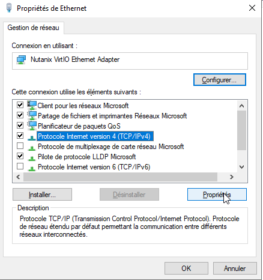
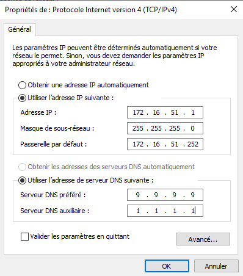

# SP 3 - Mission 1 - Configuration post-installation Windows Server MN01

**SP 3 : Gestion des services principaux AD (Active Directory) et DHCP**

**Mission 1 : Mise en place du serveur Windows Server 2019**

**Contexte : MILLENUITS**


---
## Informations générales

- **Date de création** : 05/02/2026
- **Dernière modification** : 12/03/2026
- **Auteur** : MEDO Louis

---
## Sommaire

1. Installation des pilotes sur Windows Server
2. Configuration réseau de Windows Server
3. Configuration de l'administrateur local
4. Configuration du Bureau à distance

---
## 1. Installation des pilotes sur Windows Server

1. **Trouver le pilote.** Dans l'explorateur de fichiers (Ce PC), ouvrir le `Lecteur de CD : Nutanix VirtIO 1.1.7`.
   
   
 
2. **Installer le pilote.** Exécuter l'installateur `Nutanix-VirtIO-1.1.7-amd64` pour déployer les pilotes sur Windows Server.

   
   
---
## 2. Configuration réseau de Windows Server

1. **Ouvrir les paramètres réseau.** Effectuer un clic droit sur l'icône réseau dans la barre des tâches, puis cliquer sur `Ouvrir les paramètres réseau et Internet`.
   
   
   
2. **Ouvrir le panneau de configuration.** Cliquer sur l'option `Modifier les options d'adaptateur`.
   
   

3. **Ouvrir les propriétés de la carte réseau.** Effectuer un clic droit sur la carte réseau concernée et sélectionner `Propriétés`.
   
   

4. **Configurer les paramètres IPv4.** Désactiver l'IPv6 en décochant la case correspondante. Sélectionner `Protocole Internet version 4 (TCP/IPv4)` puis cliquer sur `Propriétés`. 
   
   

5. **Saisir les informations réseau.** Cocher la case `Utiliser l'adresse IP suivante`, puis renseigner les paramètres IP statiques souhaités en suivant le plan d'adressage du projet.
   
   

!!! tip
	Un contrôleur de domaine nécessite obligatoirement une IP statique. Pour le serveur DNS primaire de cette carte réseau, renseignez l'adresse IP de bouclage (`127.0.0.1`) ou l'IP statique du serveur lui-même.

6. **Vérification.** Pour s'assurer que les paramètres réseau sont valides, vérifiez l'accès à la passerelle, à Internet et à la résolution DNS via l'invite de commandes.
   
   **Commandes à faire :**

   - [ ] `ping 172.16.51.252` : Envoie des paquets ICMP pour valider la connectivité au niveau local entre le serveur et sa passerelle.
   - [ ] `ping 9.9.9.9` : Teste le routage vers l'extérieur (Internet) en interrogeant le serveur DNS public de Quad9.
   - [ ] `ping loutik.fr` : Vérifie que le service de résolution de noms (DNS) fonctionne correctement en traduisant le nom de domaine en adresse IP.
   
---
## 3. Configuration de l'administrateur local

1. **Changement du mot de passe Administrateur local.** Il est impératif de sécuriser le compte par défaut en appliquant un mot de passe fort (minimum 16 caractères, généré de manière aléatoire et stocké de manière sécurisée via le gestionnaire de mots de passe Bitwarden). Ouvrir une invite de commandes ou PowerShell en tant qu'administrateur.
   
   **Commande à exécuter :**

```powershell
net user Administrateur "VotreMotDePasseBitwarden!"
```

   - `net user` : Utilitaire en ligne de commande permettant de gérer les comptes d'utilisateurs locaux.
   - `Administrateur` : Cible le compte système par défaut.
   - `"VotreMotDePasse..."` : Remplace l'ancien mot de passe par la nouvelle chaîne de caractères spécifiée.

---
## 4. Configuration du Bureau à distance

1. **Activation du Bureau à distance (RDP).** Cette action permet l'administration à distance du serveur, évitant ainsi de passer systématiquement par la console virtuelle Nutanix. Dans le *Gestionnaire de serveur*, aller dans *Serveur local*, cliquer sur le lien `Désactivé` à côté de *Bureau à distance*, puis cocher `Autoriser les connexions à distance à cet ordinateur`.

   **Alternative en commande PowerShell :**

```powershell
   Set-ItemProperty -Path 'HKLM:\System\CurrentControlSet\Control\Terminal Server' -name "fDenyTSConnections" -value 0
   Enable-NetFirewallRule -DisplayGroup "Bureau à distance"
```

   - `Set-ItemProperty` : Modifie une clé de registre. Ici, la valeur `0` autorise la fonctionnalité de connexions Terminal Server (RDP).
   - `Enable-NetFirewallRule` : Active la règle du pare-feu Windows, ouvrant ainsi le port TCP 3389 nécessaire au flux RDP.

!!! tip
	Une fois l'Active Directory déployé, évitez d'utiliser le compte Administrateur intégré pour les tâches quotidiennes. Créez des comptes nominatifs avec des privilèges de délégation stricts (principe de moindre privilège).
