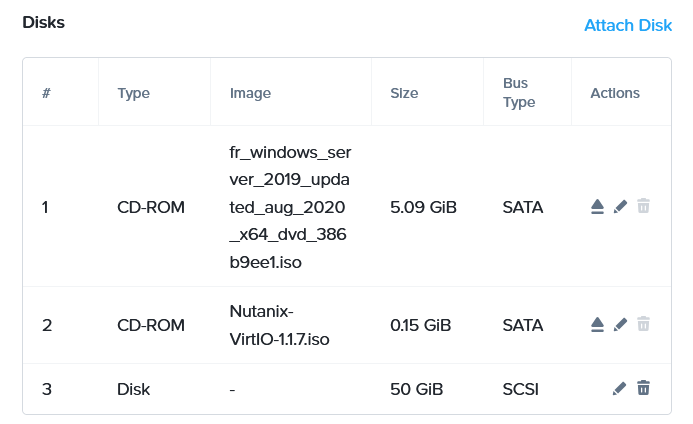

# SP 3 - Mission 1 - Création de la VM MN01 sur Nutanix

**SP 3 : Gestion des services principaux AD (Active Directory) et DHCP**

**Mission 1 : Mise en place du serveur Windows Server 2019**

**Contexte : MILLENUITS**

---
## Informations générales

- **Date de création** : 05/02/2026
- **Dernière modification** : 12/03/2026
- **Auteur** : MEDO Louis

---
## Sommaire

1. Création de la machine virtuelle sur Nutanix

---
## 1. Création de la machine virtuelle sur Nutanix

**Onglet Configuration :**
1. **Création de la machine virtuelle.** Aller dans l'interface de Nutanix, puis cliquer sur *Create VM*. Saisir les informations suivantes :

   - **Name :** `SIO1 - AP - GPI1 - MN01`
   - **Description :** `Millenuits - Active directory`
   - **Project :** `SIO1-Etudiant 2`
   - **CPU :** 1

**Onglet Ressources :**
1. **Création des disques et ajout des images ISO.** Créer le disque de stockage pour Windows Server, puis monter l'image ISO pour l'installation de l'OS ainsi que l'image ISO contenant les pilotes VirtIO.
   
   
2. **Configuration du réseau.** Sélectionner le réseau `Projet A` avec l'ID VLAN `51`.
   
   
3. **Configuration du boot.** Choisir le mode `UEFI BIOS Mode`.
   
**Onglet Management :**
1. **Configuration de l'heure.** Sélectionner le fuseau horaire `Europe/Paris`.
   

!!! note
	Veillez à provisionner un disque de taille suffisante (minimum 60 Go pour une version avec interface graphique) afin d'anticiper la croissance de la base de données NTDS et les futures mises à jour Windows.

---