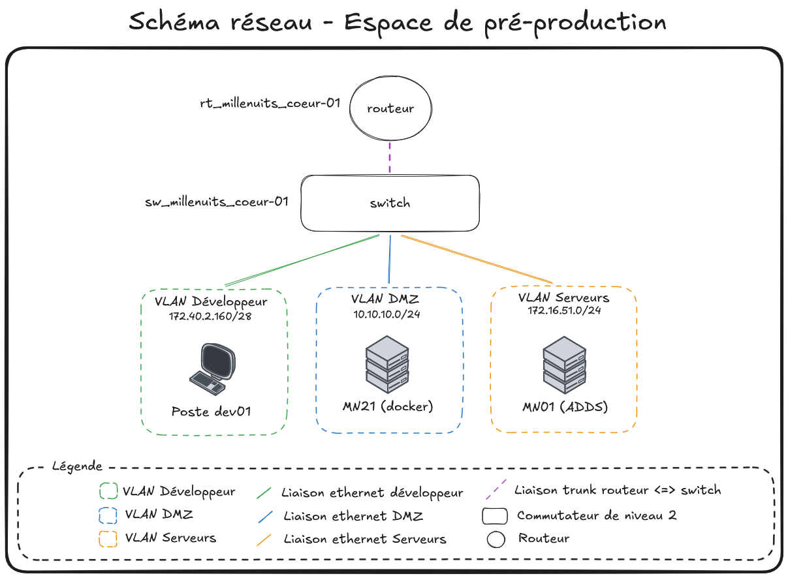
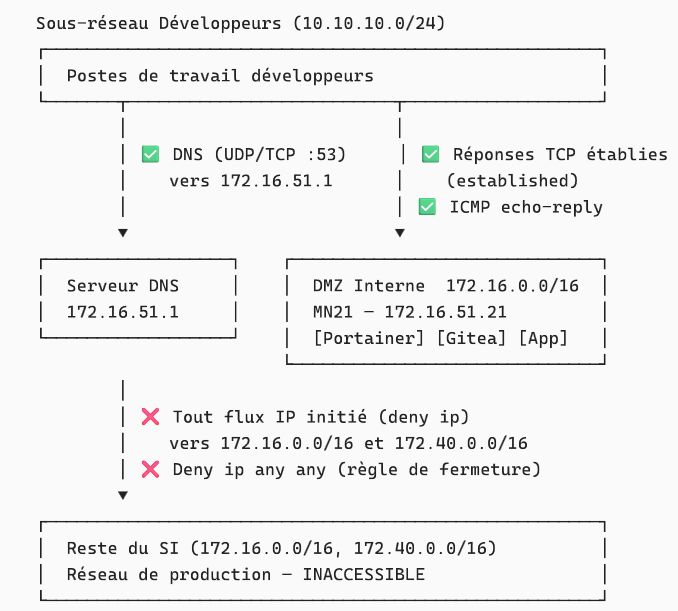
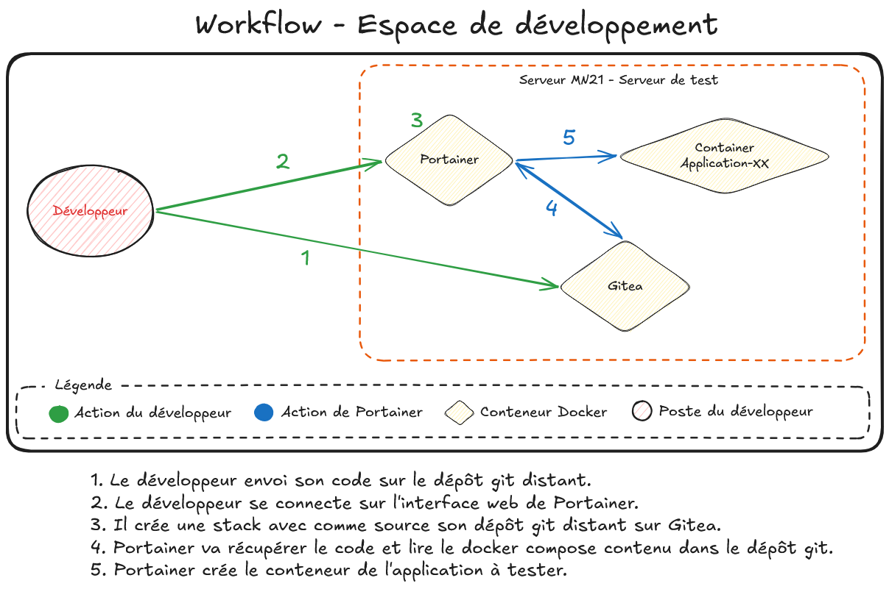

# SP 4 - Mission 1 - DAT - Espace de développement

**SP 4 : Mise en place d'un espace de développement**

**Mission 1 : Mise en place d'un environnement de test conteneurisé dans une DMZ interne avec Docker et préparation d'une formation développeurs.**


---

## Informations générales

- **Date de création** : 09/04/2026
- **Dernière modification** : 09/04/2026
- **Mainteneur** : MEDO Louis

---

## Sommaire

- A. [Vue d'ensemble et contexte](#a-vue-densemble-et-contexte)
- B. [Architecture système et composants](#b-architecture-système-et-composants)
- C. [Réseau et sécurité](#c-réseau-et-sécurité)
- D. [Gestion des identités et des accès](#d-gestion-des-identités-et-des-accès)
- E. [Workflow développeur](#e-workflow-développeur)

---

## A. Vue d'ensemble et contexte

### Présentation

Ce document décrit l'architecture technique de l'espace de développement mis en place pour **Millenuits**, reposant sur une infrastructure conteneurisée avec Docker, hébergée dans une DMZ interne sur le serveur de pré-production **MN21**.

**Objectifs de l'architecture :**

- Fournir aux développeurs un environnement de test isolé, reproductible et facilement déployable
- Éviter les conflits de versions et les problèmes de dépendances liés au développement sur des machines partagées
- Isoler strictement l'environnement de test du réseau de production via une DMZ interne
- Centraliser la gestion des conteneurs via une interface web sécurisée (Portainer)
- Versionner les configurations d'infrastructure via un dépôt Git interne auto-hébergé (Gitea)
- Appliquer le principe de moindre privilège sur l'ensemble de la chaîne d'accè

### Schéma de l'infrastructure



*Schéma réseau - Espace de développement*

---

## B. Architecture système et composants

### Infrastructure mise en place

| Élément | Description |
|---|---|
| **Serveur MN21** | Serveur Linux (Debian) dédié, hébergé dans la DMZ interne. Constitue le socle physique unique de l'environnement de test. |
| **Réseau DMZ interne** | Sous-réseau isolé du réseau de production par des règles de filtrage (ACL Cisco). Accessible uniquement depuis le sous-réseau développeurs. |
| **Poste développeur** | Poste de travail standard du développeur, situé dans le sous-réseau développeurs. Accède aux services MN21 via HTTP/HTTPS sur les ports dédiés. |

### Socle d'hébergement

L'ensemble des services applicatifs est conteneurisé et tourne sur le moteur Docker installé sur MN21. Le déploiement est orchestré par Docker Compose.

- **Docker Engine** — Moteur de conteneurisation. Fournit l'isolation des processus, la gestion des ressources et le réseau virtuel entre conteneurs. Durci via `daemon.json` (voir section C).

- **Portainer CE `2.40.0-alpine`** — Interface graphique web d'administration Docker. Accessible sur `https://172.16.51.21:9443`. Permet aux développeurs de déployer et gérer leurs stacks de conteneurs sans accès SSH au serveur. Son accès au socket Docker (`/var/run/docker.sock`) est rendu possible par une exception de namespace (`--userns=host`).

- **Gitea `1.21`** — Forge Git auto-hébergée. Accessible sur `http://gitea.millenuits.lan:3000`. Sert de dépôt central pour le code source et les fichiers de configuration Docker Compose. Exposé également en SSH sur le port `222` de l'hôte pour éviter le conflit avec le port SSH système (`22`).

- **PostgreSQL `15-alpine`** — Base de données relationnelle dédiée à Gitea. N'est pas exposée sur le réseau hôte — elle communique avec Gitea uniquement via le réseau virtuel Docker interne `gitea_net`. Dispose d'un healthcheck natif (`pg_isready`) pour garantir que Gitea ne démarre que lorsque la base est prête.

---

## C. Réseau et sécurité

### Réseau (ACL Cisco)



*Schéma logique - ACL CISCO*

**Configuration ACL Cisco appliquée (`DMZ` — sens sortant du sous-réseau développeurs) :**

```
ip access-list extended DMZ
 remark Autorisation requetes DNS vers serveur interne
 permit udp 10.10.10.0 0.0.0.255 host 172.16.51.1 eq domain
 permit tcp 10.10.10.0 0.0.0.255 host 172.16.51.1 eq domain
 remark Autorisation des reponses
 permit tcp 10.10.10.0 0.0.0.255 172.16.0.0 0.0.255.255 established
 permit tcp 10.10.10.0 0.0.0.255 172.40.0.0 0.0.255.255 established
 permit icmp 10.10.10.0 0.0.0.255 172.16.0.0 0.0.255.255 echo-reply
 permit icmp 10.10.10.0 0.0.0.255 172.40.0.0 0.0.255.255 echo-reply
 remark Interdiction acces autres vlan
 deny   ip 10.10.10.0 0.0.0.255 172.16.0.0 0.0.255.255
 deny   ip 10.10.10.0 0.0.0.255 172.40.0.0 0.0.255.255
 remark Interdiction globale
 deny   ip any any
```

**Synthèse des règles :**

- ✅ DNS autorisé — Les développeurs (`10.10.10.0/24`) peuvent résoudre des noms de domaine internes en interrogeant uniquement le serveur DNS désigné (`172.16.51.1`) en UDP et TCP sur le port `53`. Cela leur permet d'accéder aux services MN21 via leur nom DNS (ex : `gitea.millenuits.lan`) plutôt que par IP.
- ✅ Réponses TCP établies autorisées — Le mot-clé `established` permet uniquement le retour de connexions TCP initiées par les développeurs (le flag ACK est présent). Aucune connexion ne peut être initiée depuis le SI vers le sous-réseau développeurs.
- ✅ ICMP echo-reply autorisé — Seules les réponses `ping` (echo-reply) provenant du SI sont autorisées en retour. Les développeurs peuvent donc tester la connectivité vers MN21, mais le SI ne peut pas initier de ping vers leur poste.
- ❌ Flux IP initiés bloqués — Toute tentative de connexion initiée par un développeur vers `172.16.0.0/16` ou `172.40.0.0/16` (hors DNS et réponses établies) est bloquée. Cela empêche tout accès direct aux serveurs de production ou aux autres VLANs.
- ❌ Règle de fermeture globale (`deny ip any any`) — Tout flux non explicitement autorisé par les règles précédentes est rejeté. C'est la règle implicite de sécurité par défaut.

### Sécurité (hardening Docker)

La configuration de sécurité est appliquée via le fichier `/etc/docker/daemon.json` sur MN21 :

- **Rotation des logs** (`log-driver: json-file`, `max-size: 10m`, `max-file: 3`) — Empêche les fichiers de journaux de saturer le disque. Chaque conteneur ne peut conserver que 3 fichiers de 10 Mo maximum, soit 30 Mo par conteneur au maximum.

- **Live-restore** (`live-restore: true`) — Les conteneurs continuent de fonctionner en cas de redémarrage du démon Docker. Évite une coupure de service lors des mises à jour ou rechargements de configuration du moteur.

- **User Namespace Remapping** (`userns-remap: default`) — L'utilisateur `root` (UID 0) à l'intérieur d'un conteneur est mappé vers un utilisateur non privilégié (`dockremap`) sur le système hôte. Ainsi, même si un attaquant s'échappe du conteneur, il ne dispose d'aucun privilège sur le serveur physique. *Exception justifiée :* Portainer désactive ce remapping pour lui seul (`--userns=host`) car il doit accéder au socket Docker en tant que root hôte pour administrer les autres conteneurs.

- **Blocage des élévations de privilèges** (`no-new-privileges: true`) — Interdit aux processus s'exécutant dans un conteneur d'acquérir de nouveaux droits via `sudo` ou des binaires SUID. Limite la surface d'exploitation en cas de compromission d'un conteneur.

---

## D. Gestion des identités et des accès

### Coffre-fort de mots de passe

L'ensemble des secrets de l'infrastructure (mots de passe des comptes d'administration, mots de passe des bases de données, tokens) sont gérés via **Bitwarden**, le coffre-fort d'équipe. Cette pratique répond à deux exigences fondamentales :

- **Aucun secret ne doit être stocké en clair dans le code** — Les mots de passe sensibles (ex : `GITEA_DB_PASSWORD`) ne figurent pas dans les fichiers `docker-compose.yml` versionnés sur Git. Ils sont injectés dynamiquement au moment du déploiement via les variables d'environnement de Portainer.
- **Traçabilité et partage sécurisé** — Chaque secret est consigné dans le coffre-fort de l'équipe système avec une nomenclature explicite (ex : `Gitea - Pré-production MN21 - DB Password`). Cela permet un transfert sécurisé des accès et facilite la rotation des mots de passe sans modifier le code source.

### Contrôle d'accès sur Portainer

L'accès à Portainer est structuré selon le modèle **RBAC** (Role-Based Access Control) et le principe de moindre privilège :

- **Compte d'urgence administrateur** — Un seul compte administrateur à nom non standard (généré via Bitwarden) est créé lors de l'initialisation. Il est réservé exclusivement aux situations de perte d'accès aux comptes nominatifs et son mot de passe (30 caractères minimum) est conservé dans le coffre-fort système.

- **Équipe "Développeurs"** — Les développeurs sont regroupés dans une équipe logique (`Developpeurs`) dans Portainer. L'attribution des droits se fait par équipe, ce qui simplifie l'intégration de nouveaux développeurs : il suffit de les ajouter à l'équipe existante.

- **Comptes nominatifs "Standard User"** — Chaque développeur dispose d'un compte personnel (ex : `pierre.jean`) avec le rôle *Standard User* (non administrateur). Les droits d'administration globale (gestion des utilisateurs, paramètres du serveur) sont inaccessibles depuis ces comptes.

- **Délégation de l'environnement** — L'équipe `Developpeurs` a uniquement accès à l'environnement Docker de MN21 (local). Les développeurs peuvent créer des stacks, des conteneurs et des volumes, mais uniquement dans cet environnement délégué. Ils ne peuvent pas interagir avec d'autres environnements ni modifier la configuration globale de Portainer.

---

## E. Workflow développeur

### Cycle de vie applicatif

Le cycle de vie d'une application sur l'infrastructure suit un flux **GitOps** : la source de vérité est toujours le dépôt Git.



*Schéma - Workflow espace de développement*

Le workflow se déroule en cinq étapes, entièrement au sein du serveur MN21 isolé en DMZ :

1. **Le développeur pousse son code** depuis son poste vers le dépôt Git distant hébergé sur **Gitea** (conteneur Docker sur MN21). Gitea joue le rôle de source de vérité pour le code source et les fichiers de configuration d'infrastructure (`docker-compose.yml`).

2. **Le développeur se connecte à Portainer** via son navigateur web sur l'interface HTTPS (port 9443). Son accès est restreint à l'environnement de développement qui lui a été délégué — il ne peut pas accéder aux paramètres globaux du serveur.

3. **Le développeur crée une Stack dans Portainer** en pointant vers son dépôt Gitea. Portainer utilise la méthode "Repository" : il lit directement le `docker-compose.yml` stocké dans le dépôt Git, ce qui garantit que le déploiement est toujours synchronisé avec le code versionné.

4. **Portainer récupère la configuration** en allant lire le fichier `docker-compose.yml` depuis le dépôt Gitea. Cette étape constitue le cœur de l'approche **GitOps** : l'infrastructure est décrite sous forme de code, versionnable et auditable.

5. **Portainer instancie les conteneurs** de l'application à tester (service web, base de données, etc.) sur le moteur Docker de MN21. Le conteneur applicatif est alors accessible depuis le sous-réseau développeurs.

**Exemple concret — Déploiement d'une application PHP + MariaDB :**

Un développeur souhaite tester une nouvelle version de son application. Il modifie son code PHP et met à jour son fichier `docker-compose.yml` pour pointer vers la nouvelle image. Il pousse ses changements sur Gitea (`git push`). Il se connecte ensuite sur Portainer, navigue vers sa Stack et clique sur **Pull and redeploy** : Portainer va chercher la dernière version du `docker-compose.yml` sur Gitea et redémarre les conteneurs avec les nouveaux paramètres. En moins d'une minute, le développeur peut accéder à `http://172.16.51.21:8080` pour valider son application.

### Responsabilités du développeur

Le développeur est responsable de la qualité et de la cohérence de son dépôt Git sur Gitea. Concrètement, cela implique :

- **Code source** — Versionner l'intégralité du code applicatif sur Gitea. Chaque modification significative doit faire l'objet d'un commit avec un message explicite. Le dépôt constitue la référence : si un conteneur est recréé, c'est le code présent sur Gitea qui sera utilisé.

- **Configuration Docker** — Maintenir à jour le fichier `docker-compose.yml` dans le dépôt. Ce fichier décrit l'infrastructure de l'application (services, images, ports, volumes). Il ne doit **jamais** contenir de secrets en clair — les mots de passe doivent être passés via des variables d'environnement injectées dans Portainer.

- **Base de données** — Les développeurs sont responsables de la persistance de leurs données de test. Les volumes Docker garantissent la survie des données entre les redémarrages de conteneurs, mais **pas** entre les suppressions de stacks. Le développeur doit versionner ses scripts d'initialisation SQL (ou équivalent) dans le dépôt Git afin de pouvoir recréer un jeu de données cohérent à tout moment.