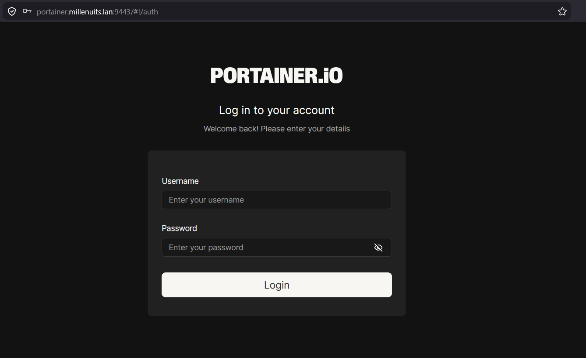
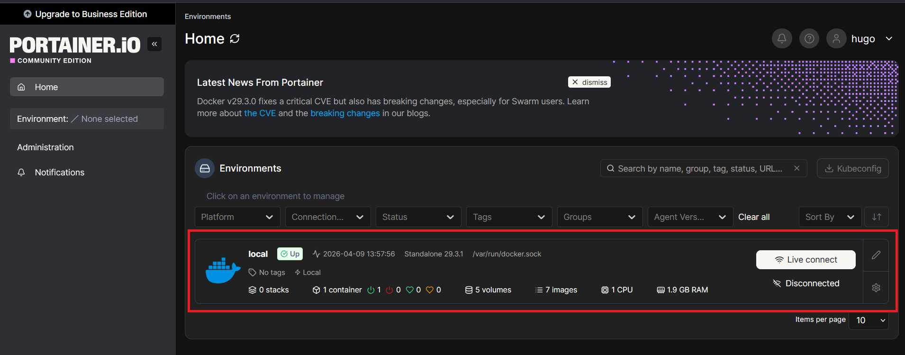
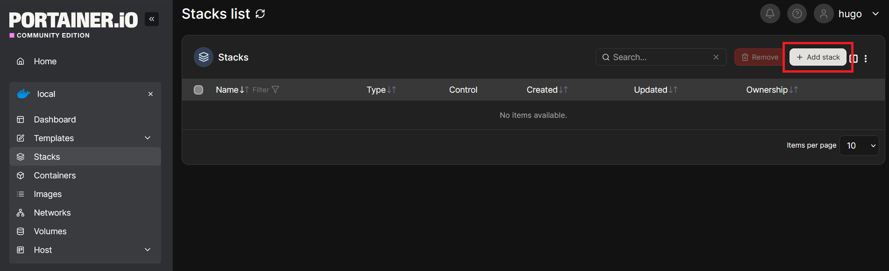
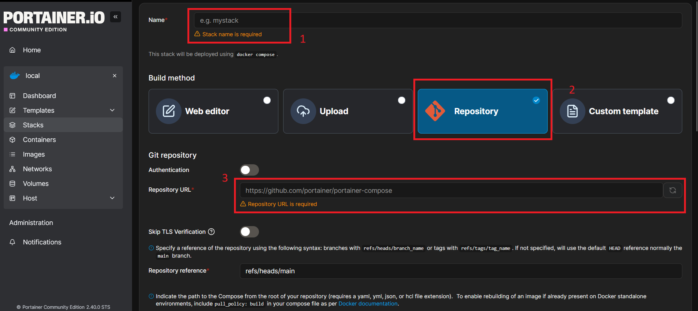
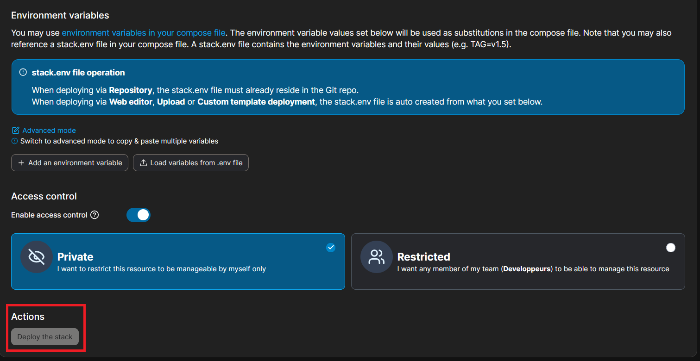

# SP 4 - Mission 1 - Guide de Déploiement GitOps sur Portainer

**SP 4 : Mise en place d’un espace de développement**

**Mission 1 : Mise en place d’un environnement de test conteneurisé dans une DMZ interne avec Docker et préparation d’une formation développeurs.**

---

## Informations générales

  - **Date de création** : 09/04/2026
  - **Dernière modification** : 09/04/2026
  - **Mainteneur** : MEDO Louis

---

## Sommaire

  - A. Connexion à l'interface d'administration Portainer
  - B. Déploiement de l'application via un dépôt Git
  - C. Vérification de l'accessibilité du service Web

---

## A. Connexion à l'interface d'administration Portainer

1. **Accès au portail d'authentification.** Ouvrir un navigateur web et naviguer vers l'URL de gestion de l'infrastructure.

    [http://portainer.millenuits.lan:9443](http://portainer.millenuits.lan:9443)

2. **Authentification.** Saisir les identifiants de connexion (Nom d'utilisateur et Mot de passe) attribués, puis cliquer sur le bouton **Login**.

    

3. **Sélection de l'environnement.** Sur la page d'accueil (Home), cliquer sur l'environnement nommé **local** afin d'accéder aux ressources rattachées à ce nœud Docker.

    

---

## B. Déploiement de l'application via un dépôt Git

*Note : L'approche GitOps consiste à utiliser un dépôt Git comme source unique de vérité. Portainer se charge de cloner le dépôt et d'exécuter les instructions du fichier `docker-compose.yml` situé à la racine.*

1. **Accès au gestionnaire de piles (Stacks).** Dans le menu latéral de gauche, sélectionner **Stacks**, puis cliquer sur le bouton **+ Add stack** situé en haut à droite de l'interface.

    

2. **Définition de la méthode de déploiement.** Saisir un nom représentatif pour l'application dans le champ **Name** (ex: `app-millenuits`, sans espaces ni majuscules). Dans la section **Build method**, sélectionner l'option **Repository**.

    

3. **Configuration du dépôt source.** Dans la section **Git repository**, renseigner l'URL complète du dépôt contenant le code source de l'application dans le champ **Repository URL**. La référence par défaut (`refs/heads/main`) cible la branche principale.

4. **Gestion des accès et déploiement.** Descendre jusqu'à la section **Access control**. Il est recommandé de sélectionner **Restricted** et d'assigner l'équipe de développement autorisée (ex: **Developpeurs**). Enfin, cliquer sur le bouton **Deploy the stack**. 
*Le déploiement peut prendre quelques instants, le temps d'instancier les conteneurs et de télécharger le code.*

    

---

## C. Vérification de l'accessibilité du service Web

1. **Validation de l'état des conteneurs.** Une fois le déploiement terminé, s'assurer depuis le menu **Containers** que les services liés à la nouvelle pile sont dans l'état `running`.

2. **Accès à l'application.** Ouvrir un nouvel onglet dans le navigateur et accéder au port exposé par le service serveur Web (Apache) configuré dans la pile.

    - [http://portainer.millenuits.lan:8080](http://portainer.millenuits.lan:8080)

    L'affichage de la page d'accueil de l'application confirme l'exécution correcte de l'environnement conteneurisé.