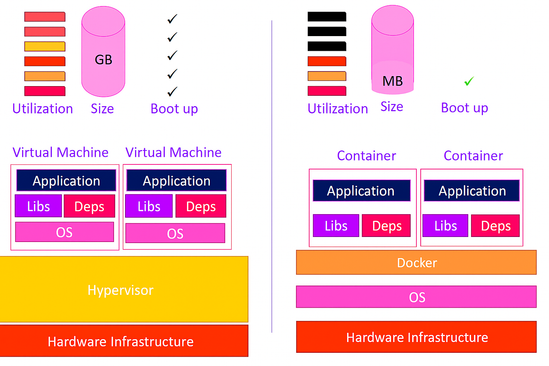

# SP 4 - Mission 1 - Formation - Introduction à docker

**SP 4 : Mise en place d’un espace de développement**

**Mission 1 : Mise en place d’un environnement de test conteneurisé dans une DMZ interne avec Docker et préparation d’une formation développeurs.**

---

## Informations générales

  - **Date de création** : 09/04/2026
  - **Dernière modification** : 09/04/2026
  - **Mainteneur** : Équipe SRE (MEDO Louis)
  - **Public cible** : Développeurs (Étudiants SLAM)

---

## Sommaire

  - 1. Qu'est-ce que Docker ?
  - 2. Le vocabulaire essentiel de Docker
  - 3. Comment fonctionne Docker ?
  - 4. Bonnes pratiques SRE (Sécurité et Conception)

---

## 1. Qu'est-ce que Docker ?

### La problématique historique

Avant l'avènement des conteneurs modernes, le développement logiciel souffrait d'un problème récurrent : le fameux syndrome du *"Ça marche sur ma machine"*. Un développeur codait une application avec des versions spécifiques de langages ou de bibliothèques. Lors du déploiement sur les serveurs de production, les différences d'environnement (système d'exploitation, versions des dépendances, configurations réseau) provoquaient des pannes complexes à diagnostiquer. 

### La solution Docker

Lancé en 2013 par l'entreprise française dotCloud (sous l'impulsion de Solomon Hykes), Docker a révolutionné l'industrie en démocratisant la **conteneurisation**. 

Docker permet d'empaqueter une application et l'intégralité de ses dépendances (bibliothèques, outils système, code) dans une unité standardisée appelée "conteneur". Ce conteneur isole l'application de l'infrastructure sous-jacente, garantissant qu'elle s'exécutera de la même manière, qu'elle soit sur l'ordinateur portable d'un développeur, sur un serveur de test en DMZ, ou dans le Cloud.

---

## 2. Le vocabulaire essentiel de Docker

La maîtrise de Docker repose sur la compréhension de quelques concepts fondamentaux qui couvrent la majorité des cas d'usage :

* **Image :** C'est un modèle en lecture seule (le "plan de construction"). Elle contient le code source, l'environnement d'exécution, les bibliothèques et les variables nécessaires. Une image est immuable : une fois créée, elle ne change plus.
* **Conteneur (Container) :** C'est l'instance en cours d'exécution d'une image. Il représente l'application vivante. Un conteneur est éphémère : il peut être démarré, arrêté ou détruit en quelques secondes.
* **Dockerfile :** C'est un simple fichier texte contenant une suite d'instructions (`FROM`, `RUN`, `COPY`, `CMD`). Docker lit ce fichier de haut en bas pour assembler et construire une Image automatisée.
* **Volume :** L'espace de stockage d'un conteneur est temporaire. Si le conteneur est détruit, les données le sont aussi. Le **Volume** est un mécanisme qui permet de sauvegarder les données de manière persistante en les stockant directement sur le serveur hôte (indispensable pour les bases de données ou le code source).
* **Registre (Registry) :** C'est une bibliothèque d'images (comme le Docker Hub public ou Harbor en privé). C'est l'endroit où l'on stocke (`push`) et télécharge (`pull`) les images.

---

## 3. Comment fonctionne Docker ?

### Conteneur vs Machine Virtuelle (VM)
Il est crucial de distinguer un conteneur d'une machine virtuelle. 

*Schéma - conteneur VS machine virtuelle*

* Une **Machine Virtuelle** virtualise le matériel. Elle nécessite un hyperviseur et embarque un système d'exploitation invité (Guest OS) complet pour chaque application. C'est lourd (plusieurs gigaoctets) et lent à démarrer (plusieurs minutes).

* Un **Conteneur** virtualise le système d'exploitation. Il partage le noyau (Kernel) du serveur hôte avec les autres conteneurs. Il n'embarque que les exécutables strictement nécessaires à l'application. C'est ultra-léger (quelques mégaoctets) et démarre instantanément.

### Le système de fichiers par couches (Layers)
La puissance de Docker réside dans son architecture en couches (Union File System). Chaque ligne d'un fichier `Dockerfile` crée une nouvelle couche superposée à la précédente.

* Si une modification est apportée au code source, Docker ne reconstruit que la couche finale contenant le code. Les couches inférieures (comme l'installation de PHP ou d'Apache) sont mises en cache et réutilisées. Cela rend la construction et le téléchargement des images extrêmement rapides.

### L'orchestration avec Docker Compose
Une application moderne est rarement composée d'un seul élément. Elle nécessite souvent un serveur web, une base de données et un cache. 

**Docker Compose** est l'outil qui permet de définir et de gérer des applications multi-conteneurs. Via un fichier unique `docker-compose.yml`, il est possible de déclarer les services, les réseaux isolés et les volumes partagés, puis de lancer l'intégralité de l'environnement avec une seule commande.

---

## 4. Bonnes pratiques

En tant que développeur, adopter les réflexes DevOps garantit la fiabilité des applications en production :

1. **Un conteneur = Un processus :** Ne jamais mélanger Apache et MariaDB dans le même conteneur. La séparation des rôles facilite la mise à l'échelle, les mises à jour et le débogage.
2. **Pensée éphémère (Stateless) :** Un conteneur doit pouvoir être détruit et remplacé à tout moment sans perte d'information. Toute donnée critique doit être externalisée dans un Volume ou une base de données.
3. **Principe du moindre privilège :** Par défaut, les processus dans un conteneur s'exécutent en tant que `root`. Il est impératif de configurer l'image pour utiliser un utilisateur restreint (ex: `www-data` ou `node`) afin de limiter les risques en cas de faille de sécurité.
4. **Fichiers `.dockerignore` :** À l'image de Git, utiliser un fichier d'exclusion permet d'éviter de copier des fichiers inutiles, lourds ou sensibles (dossier `.git`, fichiers `.env` de développement) à l'intérieur des images de production.