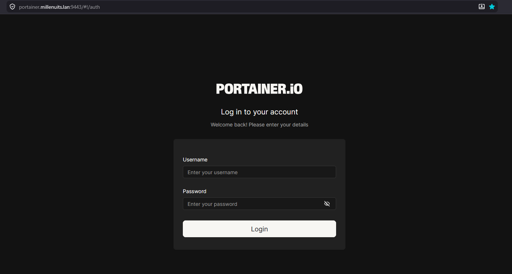
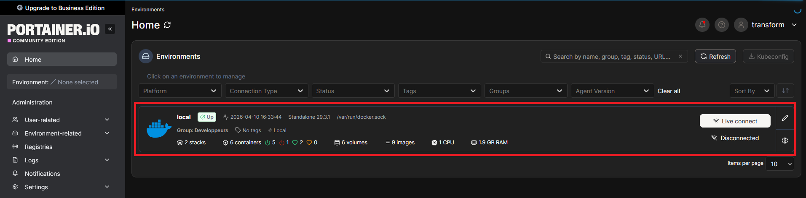
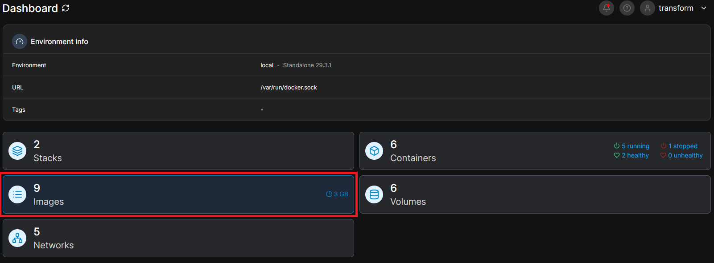
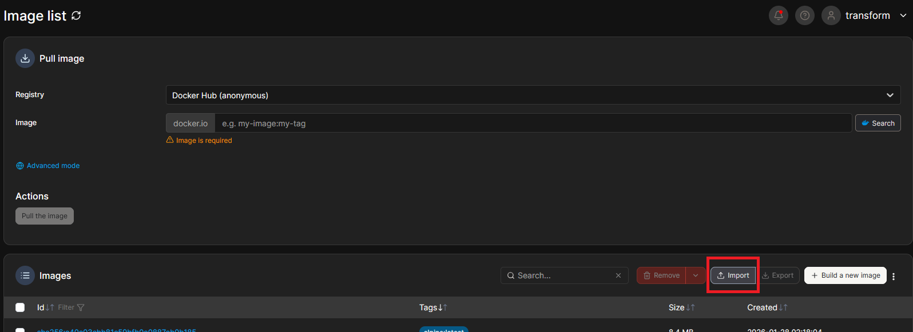

# SP 4 - Mission 1 - Guide utilisateur - Ajout des images Docker hors ligne sur Portainer

**SP 4 : Mise en place d’un espace de développement**

**Mission 1 : Mise en place d’un environnement de test conteneurisé dans une DMZ interne avec Docker et préparation d’une formation développeurs.**


-----

## Informations générales

  - **Date de création** : 10 avril 2026
  - **Dernière modification** : 10 avril 2026
  - **Mainteneur** : Louis MEDO

-----

## Sommaire

  - A. Préparation de l'archive sur un poste connecté
  - B. Transfert de l'archive vers l'environnement isolé
  - C. Importation de l'image via l'interface Portainer

-----

## A. Préparation de l'archive sur un poste connecté

1.  **Téléchargement de l'image.** Récupérer l'image Docker requise sur un terminal disposant d'un accès au réseau Internet.

    ```bash
    docker pull debian:latest
    ```

    `docker pull` : Commande permettant de télécharger une image depuis un registre distant (par défaut, Docker Hub).

    `debian:latest` : Nom de l'image ciblée suivi de son tag (version spécifique, ici la plus récente).

2.  **Exportation de l'image.** Convertir l'image téléchargée en une archive locale afin de permettre son déplacement hors ligne.

    ```bash
    docker save -o debian_latest.tar debian:latest
    ```

    `docker save` : Commande exportant les couches d'une image Docker vers un flux d'archive.

    `-o debian_latest.tar` : Argument (output) définissant le nom du fichier d'archive généré en sortie.

-----

## B. Transfert de l'archive vers l'environnement isolé

1.  **Copie sécurisée du fichier.** Transférer l'archive `.tar` vers le poste d'administration qui interagit avec l'instance Portainer hors ligne.

    ```bash
    scp debian_latest.tar administrateur@ip_serveur_cible:/chemin/destination/
    ```

    `scp` : Outil de copie de fichiers de manière sécurisée s'appuyant sur le protocole SSH.

    `administrateur@ip_serveur_cible:/chemin/destination/` : Identifiants et chemin absolu du répertoire d'accueil sur la machine de destination. *(Note : un transfert par support physique de type clé USB est également applicable selon les contraintes de sécurité)*.

-----

## C. Importation de l'image via l'interface Portainer

1.  **Authentification.** Se connecter à l'interface d'administration web de Portainer avec les identifiants requis.

    

2.  **Sélection de l'environnement.** Depuis le menu d'accueil, sélectionner l'environnement d'exécution Docker cible (ex: *local*).

    

3.  **Accès au module des images.** Depuis le tableau de bord de l'environnement, cliquer sur la section **Images**.

    

4.  **Importation de l'archive.** Dans l'interface de gestion des images, cliquer sur le bouton **Import**, sélectionner l'archive `.tar` préalablement transférée sur le poste d'administration, puis valider l'opération.

    

5.  **Vérification.** Contrôler l'apparition de la nouvelle image et de son tag dans la liste des images disponibles afin de confirmer le succès de l'intégration.